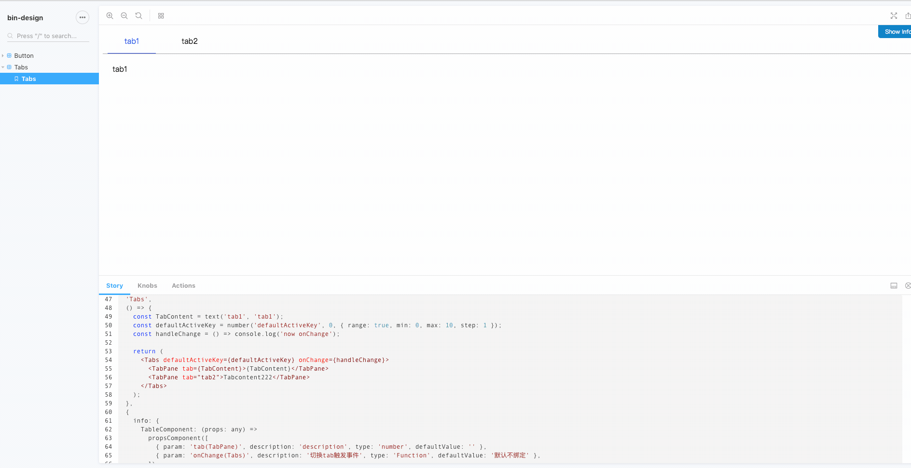

.tsx .ts 推荐使用eslint 校验

后续版本 tslint可能会被废弃 推荐使用eslint校验

- [https://medium.com/@oliver.grack/using-eslint-with-typescript-and-react-hooks-and-vscode-c583a18f0c75](https://medium.com/@oliver.grack/using-eslint-with-typescript-and-react-hooks-and-vscode-c583a18f0c75)
- [https://dev.to/robertcoopercode/using-eslint-and-prettier-in-a-typescript-project-53jb](https://dev.to/robertcoopercode/using-eslint-and-prettier-in-a-typescript-project-53jb)

## 参考antd一些基础组件的写法 结合ts react hooks 编写ui组件
- react hooks 新特性学习 demo 为组件
- 组件单元测试学习编写(jest + enzyme + storybook test addon)
- typescript 语法学习

## 运行项目查看所有ui组件(开发环境)
- `yarn storybook`
- 😜

## build storybook 部署到server进行线上查看
- `yarn build-storybook`

## 1.how to build and publish npm
- 我使用webpack 打包ts react组件(注意事项, out.libraryTarget设置为 commonjs2, externals: react)
- 可直接跑tsc命令 或者 用babel构建(暂无设计, 后续优化)
- 运行`yarn build  yarn publish` (test 命令仅供单元测试学习, 不在build前跑测试)
### 2.build 过程踩坑记录
- 没有正确设置libraryTarget 导致模块不具备export 导出的模块, 报错: webpack does not provide an export name
- 主项目引用 bin-design 时报错: Hooks can only be called inside the body of a function component. 
### 3.fix
- 针对webpack does not provide an export name, 设置libratyTarget, 参考文章: [create react component and publish npm](https://medium.com/@BrodaNoel/how-to-create-a-react-component-and-publish-it-in-npm-668ad7d363ce)
- 针对Hooks can only be called inside the body of a function component 报错, [官网解释](https://zh-hans.reactjs.org/warnings/invalid-hook-call-warning.html), 解决办法:[issue](https://github.com/facebook/react/issues/13991)
- 总结:  
    1.如果主项目使用自定义的webpack构建 增加  
      `alias: {
        react: path.resolve('./node_modules/react')
      }`  
    2. 使用create-react-app, 暂未找到通过的解决办法请参考[issue](https://github.com/facebook/react/issues/13991)
### 4. use component
- 主项目中`yarn add bin-design`, use like `import { Tabs, TabPane } from 'bin-design'`
- 因为使用styled-components, 不用额外引入样式文件👏
